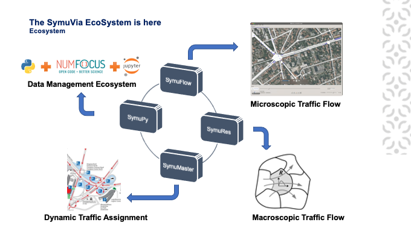

# `SymuVia` Ecosystem

The `SymuVia` ecosystem consists on toolset of traffic tools with multiple characteristics. Among them:

1. `SymuFlow`: A microsimulation traffic flow tool for exploiting vehicle traffic simulations
2. `SymuMaster`: A dynamic traffic assignment tool
3. `SymuRes`: A macroscopic traffic flow tool for exploiting MFD network simualations
4. `Symupy`: A python package to execute traffic flow simulations from `SymuFlow`, `SymuRes`

