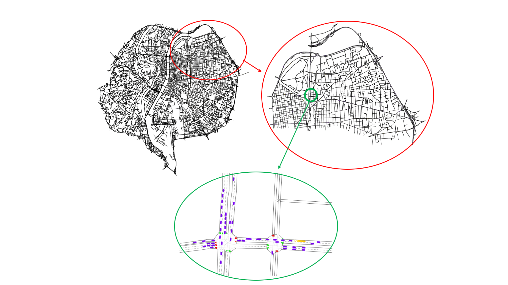

# Introduction

## What is symupy?

`SymuPy` is a python package to perform and deploy traffic simulations within the [*SymuVia*](http://github.com/licit-lab/symuvia) ecosystem via python without much effort.

## Why symupy?

The objective of `symupy` is to bring traffic data into the python world so that all tools available in the data science ecosystem  are available for you. Traffic flow simulators are already available in the market, the objective with this package is to be able to deploy simulations with microscopic open source solutions such as ['SymuFlow'](http://github.com/licit-lab/symuflow).

## How to get symupy?

You may get the source code from this [repository](https://github.com/licit-lab/symupy), for developing purposes. If you want to use symupy just for your regular you can get it from conda. For more details check the install procedure.

## Can I contribute to the development?

Yes, Symupy is an open source project licensed via a [MIT](../../../LICENSE) license so you are more than welcome to contribute. Check the contribution guidelines for more details.
